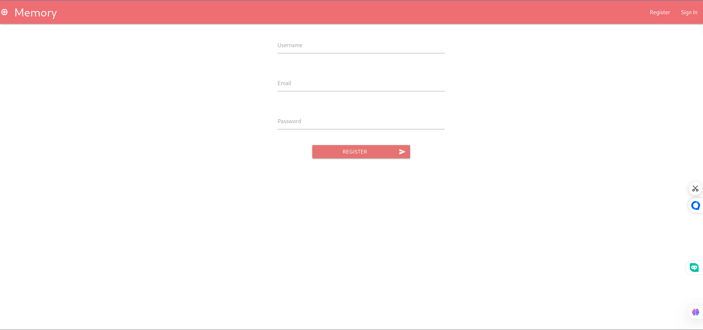
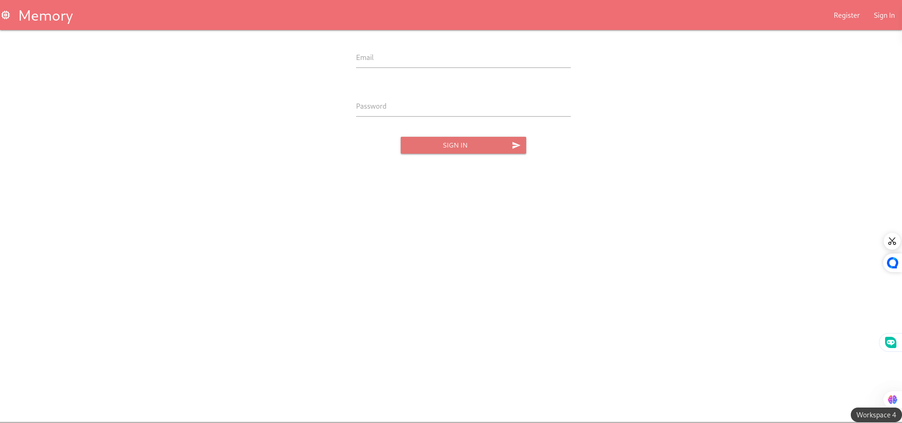
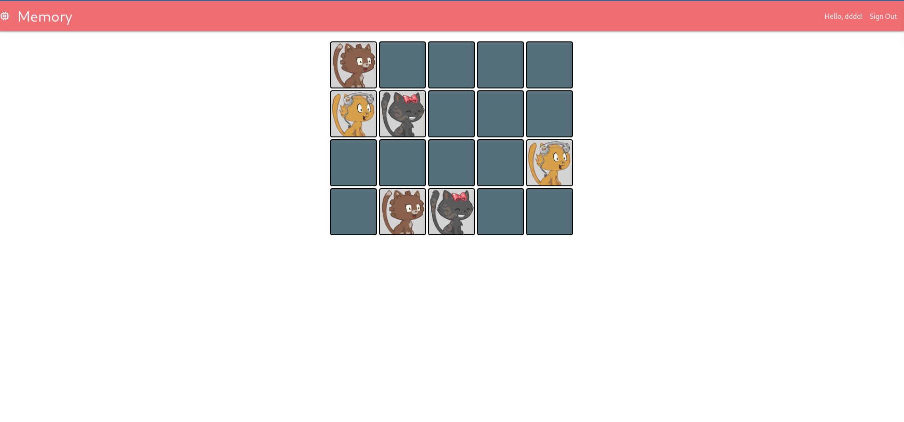
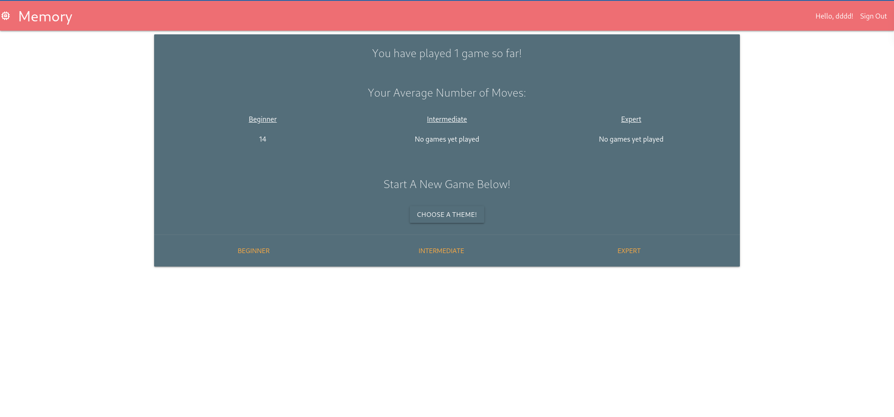

# Memory Game Deployment with Docker Compose

## Overview

This project deploys a Memory Game application consisting of:

- **Frontend**: Built with React, served using Nginx.
- **Backend**: A Node.js API running on Express.
- **Database**: MongoDB for data storage.

Docker Compose is used to orchestrate the deployment of these services.

## Project Structure

```
.
├── docker-compose.yml  # Docker Compose configuration
├── Shots
├── README.md           # Project documentation
```

## Prerequisites

Ensure you have the following installed:

- Docker
- Docker Compose

## Setup & Usage

### 1. Clone the repository

```sh
git clone https://github.com/mohamedesmael10/Dockerized-Memory-Game.git
cd Dockerized-Memory-Game
```

### 2. Start the application

```sh
docker-compose up -d
```

This will pull the latest images and start the backend, frontend, and database containers.

### 3. Access the Backend API

- API: [http://localhost:5000](http://localhost:5000)


### 4. Register and Sign In

- If you don't have an account, **register** first.
  
  
  
- If you already have an account, **sign in** to start playing.
  
  
  
- Have fun with the memory games!
  
  
  


### 5. Stop the application

```sh
docker-compose down
```
## Docker Images

- Backend Image: `mohamedesmael/memory-game-backend:latest`
- Database Image: `mohamedesmael/memory-game-database:latest`
- Frontend Image: `mohamedesmael/memory-game-frontend:latest`

## Environment Variables

These variables are defined in `docker-compose.yml`:

- `NODE_ENV=production`: Defines the environment mode.
- `JWT_SECRET`: Secret key for JWT authentication.

## Troubleshooting

### 1. Check container logs

```sh
docker logs memory-game-backend
```

```sh
docker logs memory-game-frontend
```

```sh
docker logs memory-game-database
```

### 2. Restart containers

```sh
docker-compose restart
```
## Contact

Connect with me on [LinkedIn](https://www.linkedin.com/in/mohamedesmael/).
